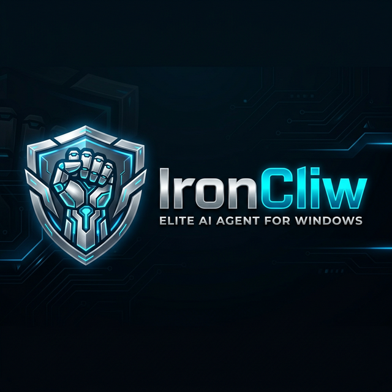

<p align="center">
  
</p>

<p align="center">
  <strong>Mastery of Windows | Autonomous AI Control | Multi-Channel Integration</strong>
</p>

<p align="center">
  <a href="LICENSE"></a>
  <a href="https://github.com/nandkishorrathodk-art/IronCliw/releases"></a>
  
</p>

---

<div align="center">

# 🦾 IronCliw

### **The Iron Grip of AI Automation**

---

[](./LICENSE)
[](https://nodejs.org)
[](https://www.microsoft.com/windows)
[](https://learn.microsoft.com/en-us/windows/wsl/)
[](./CHANGELOG.md)
[](#)

</div>

---

## 🔄 Evolution

IronCliw is a specialized derivative work that builds upon the foundation of an industry-leading AI gateway.

- **Original Project:** [OpenClaw](https://github.com/openclaw/openclaw) — A cross-platform AI agent system created by [Peter Steinberger](https://steipete.me).
- **IronCliw Version:** A dedicated **Windows-native port** and heavy modification by [Nandkishor Rathod](https://github.com/nandkishorrathodk-art), engineered for high-performance automation and advanced system control.

---

## ⚡ What is IronCliw?

**IronCliw** is a precision-engineered AI agent gateway optimized for the Windows ecosystem. It transforms your local machine into an autonomous workstation capable of executing complex tasks through simple natural language commands.

- 🪟 **Windows Native Mastery:** Built-in C# Daemon for direct OS-level interaction.
- 🐚 **PowerShell First:** Executes native scripts with `-ExecutionPolicy Bypass` reliability.
- 🧠 **Expanded Brain:** 128K context window support with parallel sub-agent orchestration.
- 📱 **Multi-Channel:** Control your PC via WhatsApp, Telegram, Discord, or iMessage.
- 👁️ **Visual Intelligence:** Uses Computer Vision (Kimi 2.x) to "see" and operate desktop applications.

> _"The Iron Grip of AI Automation."_

---

## 🆚 IronCliw vs OpenClaw

| Feature                | Original (OpenClaw) | **IronCliw** 🦾                     |
| ---------------------- | ------------------- | ----------------------------------- |
| Primary OS Focus       | Cross-Platform      | ✅ Windows Native Optimized         |
| Shell Integration      | Basic cmd.exe       | ✅ Native PowerShell 7+             |
| UI Automation          | ✗ Browser only      | ✅ Full Desktop GUI Control         |
| Visual Learning        | ✗ None              | ✅ Vision-Aided Task Execution      |
| Context Window         | 8K tokens           | ✅ 128K tokens                      |
| Parallel Subagents     | 4                   | ✅ 16 agents                        |
| Windows Native Daemon  | ✗                   | ✅ IronCliwDaemon (C#)              |
| Branding               | Lobster             | ✅ Iron/Cyber Theme                 |

---

## 🏗️ Architecture

IronCliw operates on a **3-Tier Industrial Architecture**:

```
┌─────────────────────────────────────────────────────────────────┐
│                    TIER 1 — THE BRAIN                           │
│           Node.js / TypeScript Core  (LLM Logic)                │
│    Claude · OpenAI · Fireworks · Gemini · Ollama · Groq         │
│         WebSocket Gateway → ws://127.0.0.1:18789                │
└──────────────────────────┬──────────────────────────────────────┘
                           │  IPC (WebSocket / gRPC)
┌──────────────────────────▼──────────────────────────────────────┐
│                   TIER 2 — THE MUSCLE                           │
│              IronCliwDaemon.exe  (C# .NET Native)               │
│  Window Control · Clipboard · Input Simulation · System Stats   │
└──────────────────────────▼──────────────────────────────────────┐
                           │  Native API / vision-engine
┌──────────────────────────▼──────────────────────────────────────┐
│                   TIER 3 — THE TOOLS                            │
│         Desktop Applications · CLI Tools · Cloud APIs           │
│    Burp Suite · Playwright · Docker · Git · Python · Node       │
└─────────────────────────────────────────────────────────────────┘
```

---

## 🚀 Quick Start (Windows)

**Runtime: Node ≥ 22 | Windows 10/11 | PowerShell 7+**

```powershell
# Install globally
npm install -g IronCliw

# Run the modern initialization sequence
IronCliw onboard

# Start your gateway
IronCliw gateway start
```

---

## 📦 Build from Source

```powershell
# Clone the repository
git clone https://github.com/nandkishorrathodk-art/IronCliw.git
cd IronCliw

# Install dependencies
pnpm install

# Build UI + core
pnpm build

# Launch the initialization sequence
node IronCliw.mjs onboard
```

---

## 🔋 Power Features

### ⚡ Deep OS Integration
All shell commands run through a persistent PowerShell runspace, retaining state between commands. The AI can manage your Windows Registry, services, and system configuration autonomously.

### 👁️ Visual Mastery (Computer Vision)
Integration with **Fireworks Kimi 2.x** allows IronCliw to take screenshots of desktop applications (like Burp Suite), analyze the UI, and perform actions like a human operator.

### 🛡️ Security Guardrails
IronCliw includes a strict **Scope Manager** and **Command Filter**. You define authorized domains and operations, and the agent requires human-in-the-loop approval for any out-of-scope or sensitive actions.

---

## ⚖️ License

```
MIT License

Copyright (c) 2026 Nandkishor Rathod

This project is a heavily modified Windows port and extension of OpenClaw
(https://github.com/openclaw/openclaw).

Modifications include:
  1. Native Windows API Integration via C# Interop (IronCliwDaemon)
  2. Industrial 'Iron' UI/UX and modern terminal theming
  3. Vision-aided GUI automation engine
  4. PowerShell-first execution environment
```

---

<div align="center">

**Built with ⚡ by [Nandkishor Rathod](https://github.com/nandkishorrathodk-art) in India 🇮🇳**

_"The Iron Grip of AI Automation."_

[🌐 Website](https://IronCliw.ai) · [📖 Docs](./docs) · [🔒 Security](./SECURITY.md)

</div>
